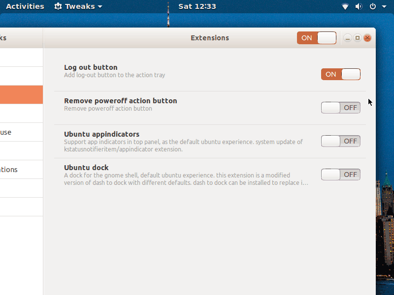
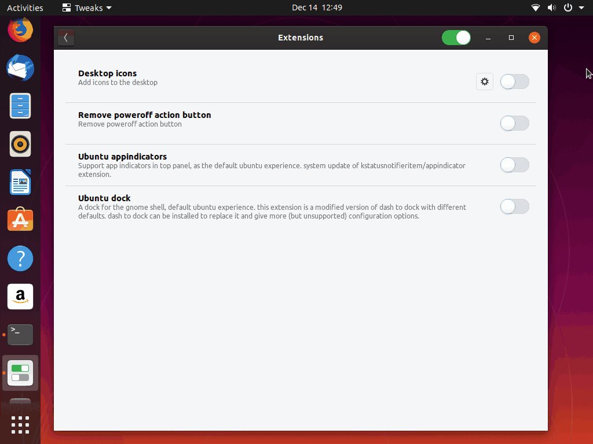

Gnome extension that hides the "Power Off button" from the status area. The system can still be power off from the command line, or once the extension is disabled. The aim is to avoid users connected remotely to see the "Power off" action. Even if they cannot power off the system, better to avoid visual temptation.

The aim of this extension is based on [a question raised at Ask Ubuntu](https://askubuntu.com/q/1179727/739431)

Tested in Ubuntu 18.04, 19.04 and 19.10

# How to install

For installing locally, just run the script `install.sh local-install` from the command line. If you want to make it system wide available, use `install.sh system` instead (as root).

Once installed, you may need to restart your Gnome Shell. Use `ALT + F2` and indicate `r`.

You can also intall the extension using the [Gnome's extension website](https://extensions.gnome.org/extension/3943/remove-poweroff-action-button/)

# Removal

Simply delete the directory `RemovePoweroffActionButton@mmartinortiz` from the installed location, either `$HOME/.local/share/gnome-shell/extensions/RemovePoweroffActionButton@mmartinortiz` or `/usr/share/gnome-shell/extensions/RemovePoweroffActionButton@mmartinortiz`
